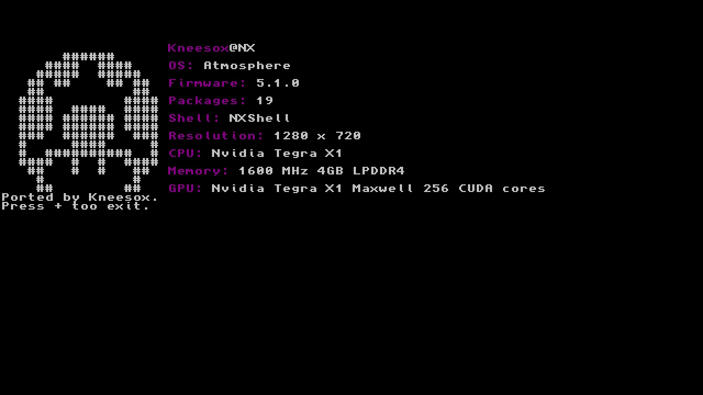

This is an NX port of the popular homebrew application for the 3DS called  made by videah.
There's been a few edits but it's effectively the same program.

To change displayed infomation please copy "config.ini" over to your SD card under the "switch" folder where the NXFetch.nro is also located. (If the config.ini isn't found this will cause the switch to crash)

